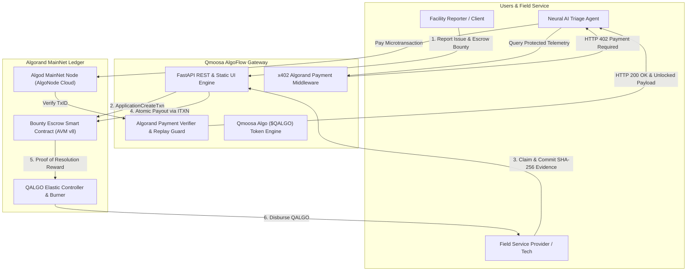

# Qmoosa AlgoFlow x402

[](https://github.com/elon00/algoflow-x402/actions/workflows/ci.yml)
[](https://opensource.org/licenses/Apache-2.0)
[](https://explorer.perawallet.app)
[](https://github.com/x402/standards)
[-9d4edd.svg)](https://github.com/elon00/algoflow-x402/blob/main/docs/TOKENOMICS_AND_GLOBAL_STRATEGY.md)

**Qmoosa AlgoFlow x402** is an enterprise-grade autonomous issue-resolution and microsettlement engine deployed on **Algorand MainNet**, powered by **Qmoosa Algo (`$QALGO`)** and the **x402 (HTTP 402 Payment Required)** standard.

Instead of navigating manual work orders, delayed invoicing, and fragmented communication, Qmoosa AlgoFlow connects facility managers, field technicians, IoT devices, and AI triage agents directly to immutable smart contract escrows on Algorand.

---

## 🌟 Key Features

### 1. Algorand MainNet Smart Contracts (AVM v8)
- **Autonomous Bounty Escrow (`escrow_contract.teal`):**
  - Lock ALGO or QALGO in smart contracts.
  - State machine: `OPEN` (0) → `CLAIMED` (1) → `RESOLVED` (2) → `CLOSED` (3) / `REFUNDED` (4).
  - SHA-256 cryptographic evidence commitment on-chain.
  - Atomic payouts executed via native Algorand Inner Transactions (`itxn`).
- **Elastic Token Minter & Burn Engine (`token_minter.teal`):**
  - Continuous "Proof of Resolution" (PoR) reward minting.
  - Automated deflationary burning of 50% of platform fees.

### 2. Qmoosa Algo (`$QALGO`) Token Project
- **Token Name:** Qmoosa Algo Utility & Settlement
- **Ticker:** `QALGO`
- **Supply Model:** Unlimited / Elastic Supply Architecture ($2^{64}-1$ micro-units maximum AVM ceiling = $\approx 18.44$ Trillion whole tokens).
- **Participant Allowance Faucet:** Free starting allocation granted to all users, reporters, and service providers to sponsor transaction gas fees and encourage immediate participation.
- **Service Use-Case Marketplace:** Users and service providers can directly exchange/redeem their earned QALGO tokens to access:
  - **IoT Diagnostics Telemetry** (10 QALGO)
  - **Neural AI Triage & OEM Part Matcher** (50 QALGO)
  - **Cryptographic Compliance Audit Trail** (100 QALGO)
  - **Priority SLA Fast-Track Dispatch** (250 QALGO)

### 3. Native x402 Algorand Micropayment Gateway
- Implements RFC HTTP 402 Payment Required for machine-to-machine microtransactions.
- Standard headers: `WWW-Authenticate`, `X-402-Blockchain: algorand`, `X-402-Network: mainnet`, `X-402-Amount`, `X-402-Receiver`, `X-402-Challenge`.
- Automatically returns deep-linked `algorand://` URIs supported by **Pera Wallet**, **Defly**, and **Daffi**.
- Replay-protected Algorand transaction verification via Algod/Indexer nodes.

---

## 🏗️ Architecture



---

## 🚀 Quickstart

### Prerequisites
- Python 3.10+
- Pip & Git

### 1. Clone & Install
```bash
git clone https://github.com/elon00/algoflow-x402.git
cd algoflow-x402
pip install -r requirements.txt
```

### 2. Run Test Suite
```bash
python -m pytest -v
```
*(All 19 tests verifying TEAL compilation, wallet generation, x402 payment headers, and token service exchange pass automatically!)*

### 3. Launch Local Server
```bash
uvicorn algoflow.api.app:app --host 0.0.0.0 --port 8000 --reload
```
Open **[http://localhost:8000](http://localhost:8000)** in your browser to access the live cyber-fintech dashboard.  
Explore the interactive Swagger API documentation at **[http://localhost:8000/docs](http://localhost:8000/docs)**.

---

## 📡 Live Endpoints Overview

| Method | Endpoint | Description |
| :--- | :--- | :--- |
| `GET` | `/api/health` | Service and Algorand network health check |
| `GET` | `/api/network` | Live Algorand MainNet round height & node latency |
| `POST` | `/api/network/switch` | Toggle between MainNet and TestNet dynamically |
| `GET` | `/api/network/wallet/generate` | Generates 25-word Algorand keypair & public address |
| `GET` | `/api/bounties` | List operational bounties with on-chain escrow state |
| `POST` | `/api/bounties` | Create a new bounty and register escrow |
| `POST` | `/api/bounties/{id}/claim` | Technician claims open bounty |
| `POST` | `/api/bounties/{id}/resolve` | Submit completion notes & commit SHA-256 evidence hash |
| `POST` | `/api/bounties/{id}/release` | Execute atomic payout via Algorand Inner Transaction |
| `GET` | `/api/protected/diagnostics` | **[x402 Protected - 0.01 ALGO]** Machine telemetry & vibrational FFT |
| `GET` | `/api/protected/ai-triage` | **[x402 Protected - 0.05 ALGO]** Neural root-cause & OEM parts |
| `GET` | `/api/protected/audit-report` | **[x402 Protected - 0.10 ALGO]** Cryptographic compliance report |
| `GET` | `/api/token/metrics` | Qmoosa Algo (`QALGO`) unlimited supply and burn metrics |
| `POST` | `/api/token/faucet` | Free participant gas allowance for users & technicians |
| `GET` | `/api/token/services` | Catalog of platform services unlockable with QALGO |
| `POST` | `/api/token/exchange` | Exchange / redeem QALGO tokens directly for service access |

---

## 🧪 Testing the x402 Protocol Flow

### Step 1: Send Request without Payment
```bash
curl -i http://localhost:8000/api/protected/diagnostics?asset_id=PUMP-99
```
**Response:** `HTTP/1.1 402 Payment Required`
```http
WWW-Authenticate: X-402-Algorand realm="AlgoFlow x402 Gateway"
X-402-Blockchain: algorand
X-402-Network: mainnet
X-402-Amount: 10000
X-402-Receiver: MW6XFO4NJPVM4DW2VO3NGD3NBSOMEBVLQOVLNGAJOHASMDLGZBUJPOWWIA
X-402-Challenge: algo402_4a71cb4b3f09f4e24abdc23f81e39a77
```

### Step 2: Pay & Retry with Authorization Header
```bash
curl -i http://localhost:8000/api/protected/diagnostics?asset_id=PUMP-99 \
  -H "X-402-Payment-Authorization: txid=demo_confirmed_txid_402"
```
**Response:** `HTTP/1.1 200 OK`
```http
X-402-Settlement-Status: confirmed
X-402-TxID: demo_confirmed_txid_402
```
```json
{
  "status": "unlocked",
  "service": "Algorand Telemetry & IoT Diagnostics",
  "asset_id": "PUMP-99",
  "telemetry": {
    "vibration_rms": 0.42,
    "bearing_temp_celsius": 54.3,
    "operating_hours": 8740,
    "recommended_action": "Routine filter swap and bearing lubrication within 45 days."
  }
}
```

---

## ☁️ Deployment

### One-Click Render Deployment
This repository includes a pre-configured `render.yaml` Blueprint:
1. Connect this repo (`https://github.com/elon00/algoflow-x402`) in [Render](https://dashboard.render.com).
2. Choose **Blueprint** and click **Apply**.
3. Render automatically provisions the web service, builds Python 3.11, installs dependencies, and serves the platform.

### Docker Deployment
```bash
docker build -t qmoosa-algoflow .
docker run -p 8000:8000 -e ALGORAND_NETWORK=mainnet qmoosa-algoflow
```

---

## 📄 License & Whitepaper
- **Whitepaper & Global Strategy:** [docs/TOKENOMICS_AND_GLOBAL_STRATEGY.md](docs/TOKENOMICS_AND_GLOBAL_STRATEGY.md)
- **License:** Apache 2.0 (see [LICENSE](LICENSE))
