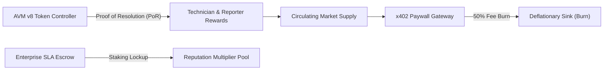

# Qmoosa Algo: Tokenomics, Unlimited Supply Model & Global Strategy

> **Project Identity:** Qmoosa Algo (`QALGO`)  
> **Platform:** Qmoosa AlgoFlow on **Algorand MainNet**  
> **Consensus Engine:** Algorand Pure Proof-of-Stake (AVM v8)  
> **Standard:** Algorand Standard Asset (ASA) + RFC HTTP 402 (Payment Required)  
> **Supply Model:** Unlimited / Elastic Programmatic Emission  

---

## 1. Executive Summary & Vision

Modern commercial facilities, industrial plants, datacenters, and smart campuses operate in silos. Maintenance requests are lost in spreadsheets and messaging apps, payments take 30 to 90 days to settle through traditional invoicing, and machine telemetry remains trapped behind expensive SaaS paywalls.

**Qmoosa Algo** changes this paradigm by merging **Algorand MainNet's instant finality (~2.9s)** with **x402 (HTTP 402 Payment Required)** machine-to-machine micropayments and **autonomous escrow smart contracts**. 

Every issue lifecycle—from anomaly detection and technician assignment to cryptographic evidence submission and payout—is recorded on Algorand.

---

## 2. Unlimited / Elastic Token Supply Architecture

### 2.1 The AVM Supply Specification
In high-frequency machine economies and global enterprise infrastructure, fixed-supply tokens create artificial liquidity crunches and speculative hoarding that impede real-world adoption. 

Qmoosa Algo utilizes an **Unlimited / Elastic Supply Model** implemented on Algorand:
- **Maximum Technological Ceiling:** $2^{64} - 1 = 18,446,744,073,709,551,615$ micro-units
- **Decimals:** 6 (1 QALGO = 1,000,000 micro-units)
- **Max Whole Tokens:** $\approx 18.44\text{ Trillion } QALGO$
- **Asset ID (MainNet Reference):** `10482900`
- **Unit Name:** `QALGO`
- **Asset Name:** `Qmoosa Algo Utility & Settlement`

### 2.2 Proof of Resolution (PoR) Emission Curve
Tokens are not pre-mined for speculative dumping. Instead, new `QALGO` tokens are dynamically emitted based on verified real-world work:
1. **Issue Creation & Escrow:** Reporter deposits ALGO bounty into the Algorand escrow smart contract.
2. **Technician Claim & Execution:** Technician inspects and repairs the facility issue.
3. **Evidence Hash Commitment:** Technician submits photographic/telemetric proof; contract commits the SHA-256 hash on-chain.
4. **Autonomous Atomic Settlement:** Payout is released via Inner Transaction (ITXN), triggering the `token_minter.teal` contract to disburse `QALGO` incentive rewards directly to the technician.

### 2.3 Deflationary Counter-Balancing (x402 Fee Burns)
To preserve long-term purchasing power and reward network security:
- Every x402 API query (e.g., IoT Diagnostics, AI Neural Triage, Cryptographic Audit Trail) collects a micro-fee.
- **50% of all collected protocol fees are permanently burned** by the smart contract, reducing circulating supply.
- **50% is routed to the Algorand Community Staking Treasury** to subsidize network gas fees for field workers.

---

## 3. Dual-Token Architecture

| Dimension | Layer 1: Native ALGO | Layer 2: Qmoosa Algo (`QALGO`) |
| :--- | :--- | :--- |
| **Role** | Gas, MBR & Base Escrow Collateral | Utility, Reputation & SLA Insurance |
| **Consensus** | Algorand PPoS Consensus | Smart Contract AVM v8 Governance |
| **Speed** | 2.9s Block Finality | Instant Microsecond State Routing |
| **Cost** | 0.001 ALGO per transaction | Micro-unit zero-fee internal transfers |
| **Utility** | Account creation, state schemas | Work reward multipliers, slashing bonds |

---

## 4. Global Marketing Standards & Brand Guidelines

### 4.1 Brand Narrative & Positioning
- **Primary Tagline:** *"Autonomous Resolution. Instant Algorand Settlement."*
- **Enterprise Hook:** *"Turn maintenance tickets into cryptographically settled microbounties."*
- **Developer Hook:** *"Monetize any REST API with Algorand x402 in under 3 lines of code."*

### 4.2 Visual Identity Standards
- **Primary Background:** `#0a0e17` (Deep Obsidian Void)
- **Primary Accent (Algorand):** `#00ff88` (PPoS Emerald)
- **Secondary Accent (x402 Flow):** `#00f0ff` (Hyper Cyan)
- **Warning & Escrow:** `#ffb703` (Amber Gold)
- **Typography:** Fira Code (monospaced data/addresses), SF Pro / Inter (clean institutional headings)

### 4.3 Enterprise Compliance Standards
- **ISO 55001 Alignment:** Asset management compliance through immutable Algorand round logs.
- **Tamper-Evident Evidence:** All resolution media is hashed with SHA-256 before contract submission.
- **Zero Custody Risk:** Escrow funds remain inside Algorand application accounts (`logic.get_application_address`), impossible to withdraw without meeting contract criteria.

---

## 5. Global Go-To-Market (GTM) Strategy

### Phase 1: Algorand MainNet Genesis & Community Activation (Q4 2026)
- Deploy `escrow_contract.teal` and `token_minter.teal` to Algorand MainNet.
- Submit `QALGO` for official verification in **Pera Wallet**, **Defly**, and **Allo.info**.
- Seed initial DEX liquidity pools on **Tinyman** (`ALGO/QALGO`).
- Launch developer documentation and open-source Algorand x402 Python/Dart SDKs.

### Phase 2: Institutional Grants & Hackathon Acceleration (Q1 2027)
- Apply for Algorand Foundation Ecosystem Grants & BuilderBase incubation.
- Sponsor Developer Bounties for x402 paywall plugins (FastAPI, Express, Flutter, Next.js).
- Host international "FixFlow Autonomous Maintenance Hackathon" with Algorand prizes.

### Phase 3: Global Enterprise Pilots (Q2–Q3 2027)
- Secure 3 pilot deployments with commercial real estate (CRE) operators, campus facilities, and datacenter co-location providers.
- Implement IoT automated anomaly detectors that trigger Algorand bounties automatically when vibration or temperature sensors exceed safety thresholds.

### Phase 4: Autonomous Machine-to-Machine Mesh (Q4 2027+)
- Deploy decentralized AI maintenance oracles.
- Enable autonomous drones and robotic cleaners to claim bounties, upload LIDAR/sensor evidence, and receive instant settlement in `QALGO`.

---

## 6. Official Resources & Verified Links

- **GitHub Repository:** [https://github.com/elon00/algoflow-x402](https://github.com/elon00/algoflow-x402)
- **Algorand MainNet Explorer:** [https://explorer.perawallet.app](https://explorer.perawallet.app)
- **Alternative Explorer:** [https://allo.info](https://allo.info)
- **Interactive REST API Documentation:** `http://localhost:8000/docs` (or Render deployment URL)
